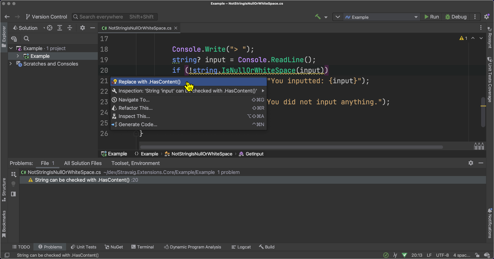
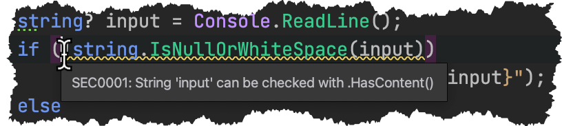
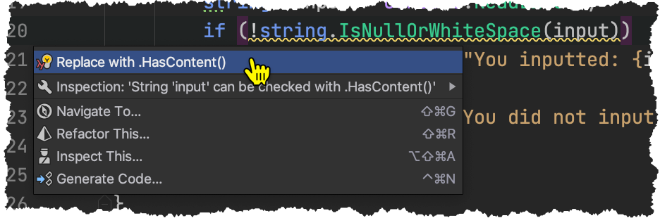
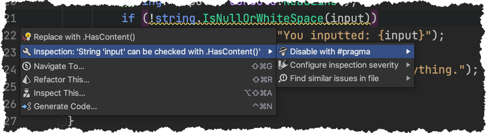
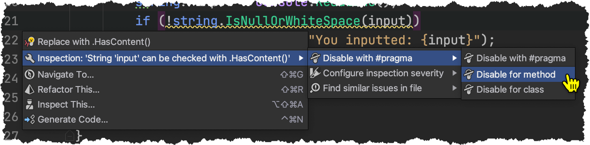

# Analysers and Code Fixes

The package comes with a set of analysers and code fixes. These can point out where you can make your code more readable and may also provide an automatic fix.

There is normally nothing additional you need to do to get these to work, by installing the package the analysers will also be installed in Visual Studio or Rider and they will inspect the code.

## Jet Brains Rider



You can hover the mouse over code in Rider to get information about the code. If there is also a wavy underline the tooltip will contain information from the analyser.



If you click on the code a lightbulb icon will show up in the gutter next to the line numbers.


You can click the icon to get the context actions menu. On Windows you can also access the menu from the keyboard using `Alt + Enter`, and on a Mac you can use `⌥ + Enter`.



### Configuring the inspections

You can configure the inspections on a case-by-case basis, or at more corse grained levels.

#### Case-by-case

By using the context action menu you get Rider to disable the inspection on a single piece of code.



This will insert a `#pragma` statements around the code. e.g.

```csharp
  Console.Write("> ");
  string? input = Console.ReadLine();
#pragma warning disable SEC0001
  if (!string.IsNullOrWhiteSpace(input))
#pragma warning restore SEC0001
    Console.WriteLine($"You inputted: {input}");
```

The `#pragma` statements can be moved to surround a larger set of code if you want to suppress the inspection over a larger area. You could even put the `disable` statement at the top of the file and omit the `restore` in order to suppress the inspection for the whole file. Be aware that this will only affect the current file.

#### At specific scopes

You can also add an attribute to suppress the inspection at a specific scope, such as a class or a method.



The attribute will then appear at the desired scope.

```csharp
[SuppressMessage("Readability", "SEC0001:String can be checked with .HasContent()")]
internal static string GetInput()
{
    // ...
}
```

Although Rider will add in a full check Id, if you are adding this manually, you can shorten it to just the code (e.g. `SEC0001`) and omit the friendly descriptor part (e.g. `:String can be checked with .HasContent()`)

