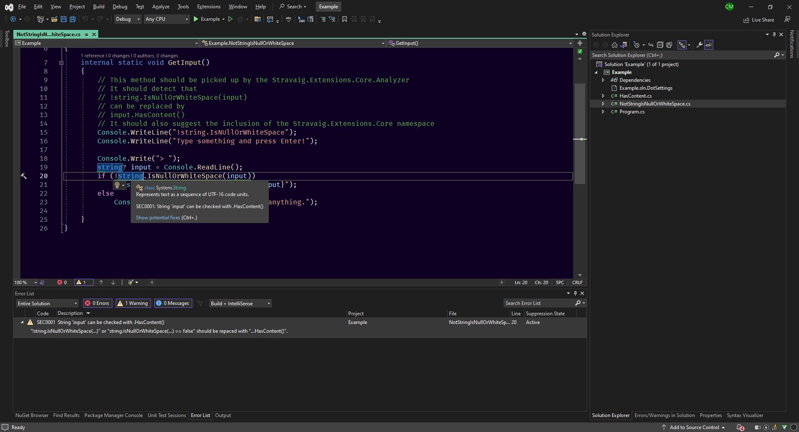
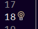
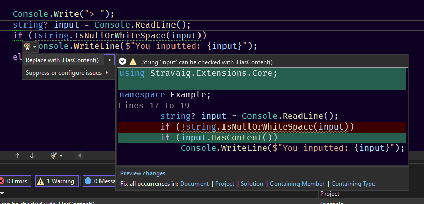
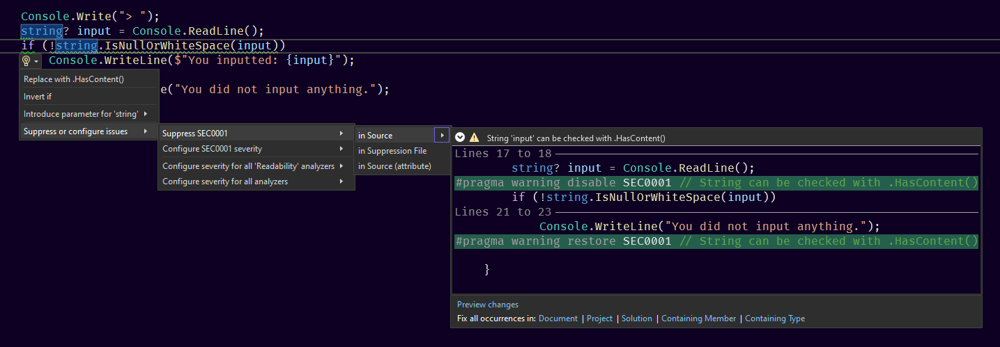
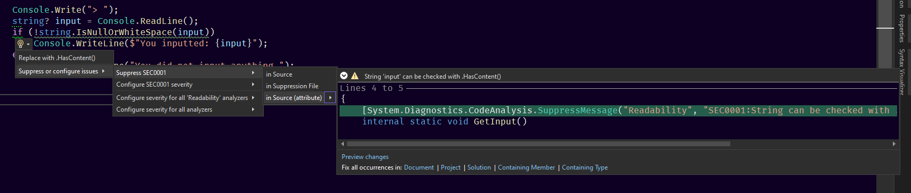
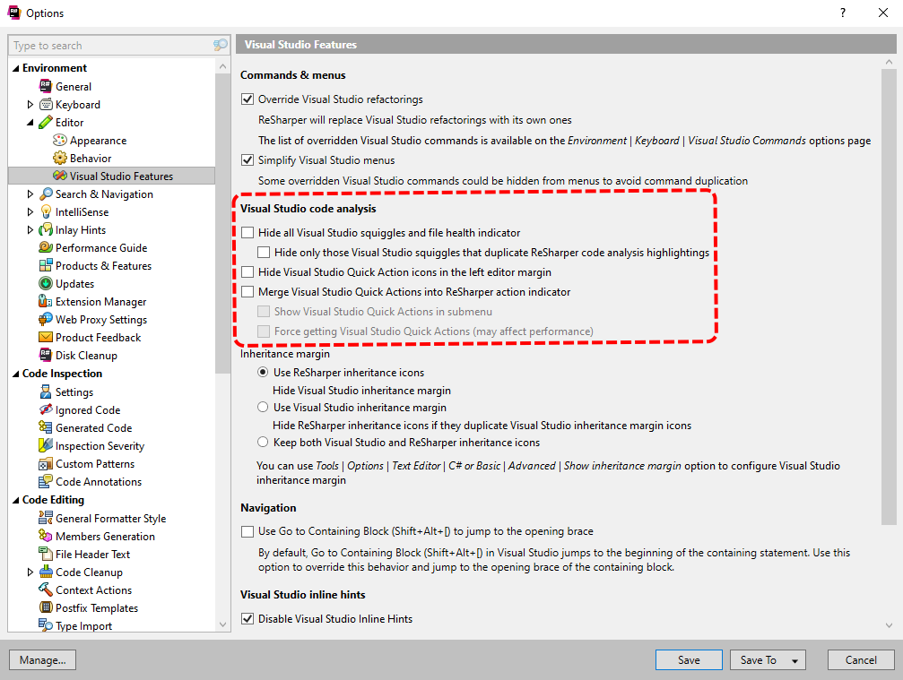

# Inspections & Code Fixes with Visual Studio

Note: If you have JetBrains ReSharper see [below](#If+You+Have+JetBrains+ReSharper+Installed).



You can hover the mouse over code in Visual Studio to get information about the code. If there is also a wavy underline the tooltip will contain information from the analyser.


There is also a lightbulb icon that shows up next to the tooltip. If you are using keyboard navigation to get around your code, the lightbulb will show up in the gutter next to the line numbers instead.



You can click the icon to get the lightbulb context menu, or can also use the keyboard shortcut `ctrl + .`



When expanded out the last leaf of the menu will show what code changes will be made by selecting that option.

### Configuring the inspections

You can configure the inspections on a case-by-case basis, or at more corse grained levels.

#### Case-by-case

By using the lightbulb context menu you get Visual Studio to disable the inspection on a single piece of code.



This will insert a `#pragma` statements around the code. e.g.

```csharp
  Console.Write("> ");
  string? input = Console.ReadLine();
#pragma warning disable SEC0001 // String can be checked with .HasContent()
  if (!string.IsNullOrWhiteSpace(input))
    Console.WriteLine($"You inputted: {input}");
  else
    Console.WriteLine("You did not input anything.");
#pragma warning restore SEC0001 // String can be checked with .HasContent()
```

The `#pragma` statements can be moved to surround a larger set of code if you want to suppress the inspection over a larger area. You could even put the `disable` statement at the top of the file and omit the `restore` in order to suppress the inspection for the whole file. Be aware that this will only affect the current file.

#### At specific scopes

You can also add an attribute to suppress the inspection at a specific scope, such as a class or a method.



The attribute will then appear at the top of the method.

```csharp
[SuppressMessage("Readability", "SEC0001:String can be checked with .HasContent()", Justification = "<Pending>")]
internal static string GetInput()
{
    // ...
}
```

Although Visual Studio will add in a full check Id you can shorten it to just the code (e.g. `SEC0001`) and omit the friendly descriptor part (e.g. `:String can be checked with .HasContent()`)

Visual Studio will also include a `Justification` argument to the attribute which you can use to document why you are suppressing the inspection.

You can also move the attribute to the class scope if you want to suppress it for the whole class and not just a specific method.

## If You Have JetBrains ReSharper Installed

If you have JetBrains ReSharper installed ensure that the options don't hide the inspections by this analyser.



To get to the options dialog in Visual Studio go to the menu `Extentions --> ReSharper --> Options...`.

Then navigate to the `Editor --> Visual Studio Features` section.

You want to turn off the hiding of Visual Studio code analysis.

---

The screenshots above are from Visual Studio 2022 v17.5.4